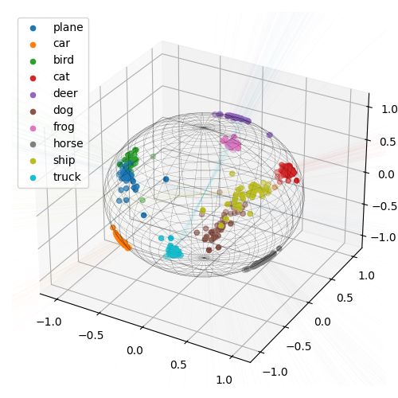
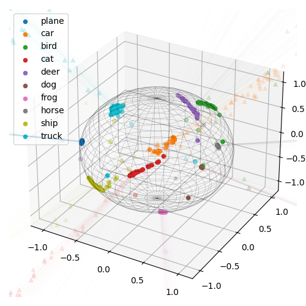

MN911 - Advanced Biometrics Security Mini Project
------

This repo contains the code of the **MN911 - Mini-project** within our **M2 - Multimedia Networking** program.

In this work, we train a slightly modified ResNet architecture using different margin-based losses on the
CIFAR-10 dataset.

<p align="center">
  
</p>

The final report can be found in [`resources/CNN-project6.pdf`](resources/CNN-project6.pdf).

## Usage

### Training

These commands are used to reproduce the ResNet-18 model we obtained.
Modify all `resnet18` to `resnet50` to train with a ResNet-50 model.

- With Cross-Entropy Loss:
```cmd
python train.py resnet18 --dataset cifar10 --model resnet18 --manual_seed 17 --batch_size 256 --epochs 250
```
- With Margin-based Cross-Entropy Losses
  _(available options for `[loss_name]` are `sphereface | cosface | arcface | curricularface | adaface`)_:
```cmd
python train.py resnet18_[loss_name] --dataset cifar10 --model resnet18 --manual_seed 17 --batch_size 256 --epochs 250 --loss [loss_name]
```

### Evaluating

For evaluating a trained model, you can run the same `train.py` script with `--eval_only` option.
All other training-exclusive parameters will be ignored.

### Visualization

To save visualization of normalized feature space, run the exact training script with `--vis` option.
This will split the last fully-connected layer in two with the intermediate dimension of 3, which we can then plot.
Note that this visualization method drastically reduce the performance of the model.
The obtained results would look like these:

<table align="center" style="margin: 0px auto;">
  <caption>Normalized Feature Space of ResNet-18</caption>
  <tr>
    <th>
      <p align="center">
      
      </p>
    </th>
    <th>
      <p align="center">
      
      </p>
    </th>
  </tr>
  <tr>
    <th>CE</th>
    <th>AdaFace</th>
  </tr>
</table>

For trained model, if it was trained using with `--vis` option, you can enable `--eval_only` parameter similar to
[Evaluating](#evaluating) section. For example:

```cmd
python train.py resnet18_ce_vis --dataset cifar10 --model resnet18 --manual_seed 17 --batch_size 512 --loss ce --resume_from outputs/resnet18_ce_vis/resnet18_250.pth --eval_only --vis
```

Otherwise, you would need to extract feature space using the [`extract_features.py`](extract_features.py) script
and then apply a dimensionality reduction technique (T-SNE, UMAP, etc.) on the saved feature vectors.
Unfortunately, we don't include that code in this repo.

## Acknowledgements

This project was conducted under the supervision of **Prof. Dijana Petrovska**.

## License

MIT licensed, see [`LICENSE.txt`](LICENSE.txt).
